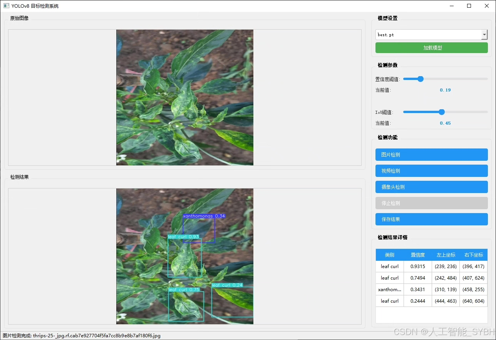
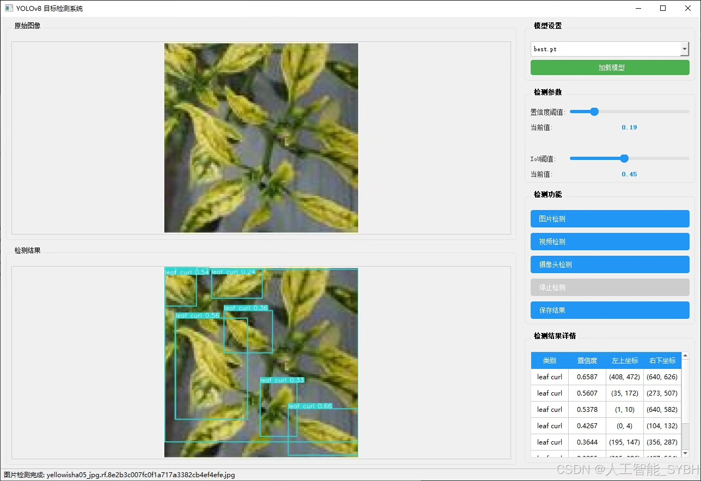
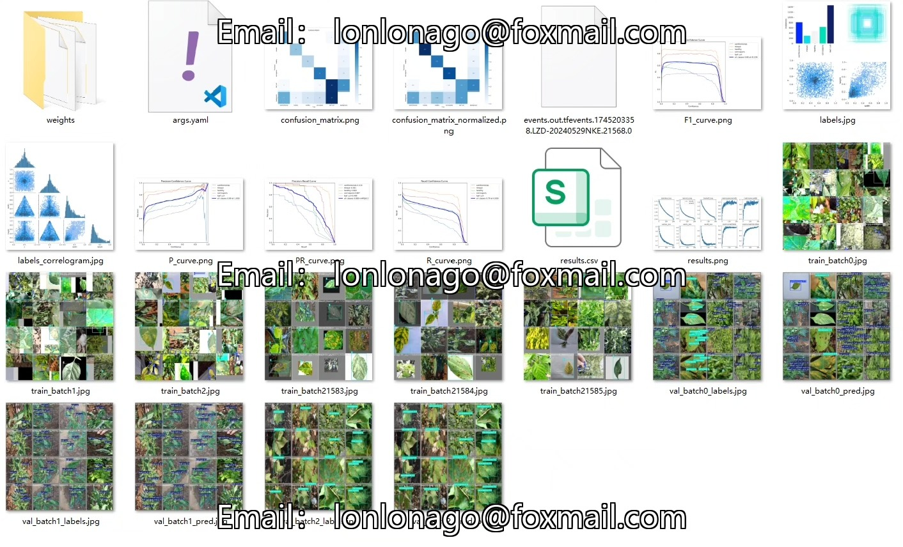
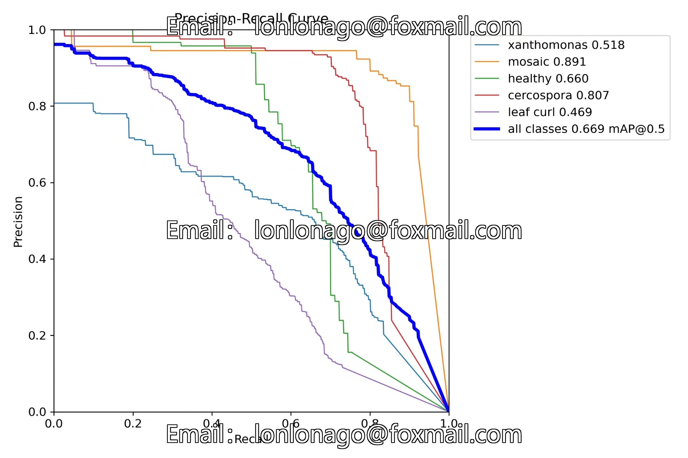
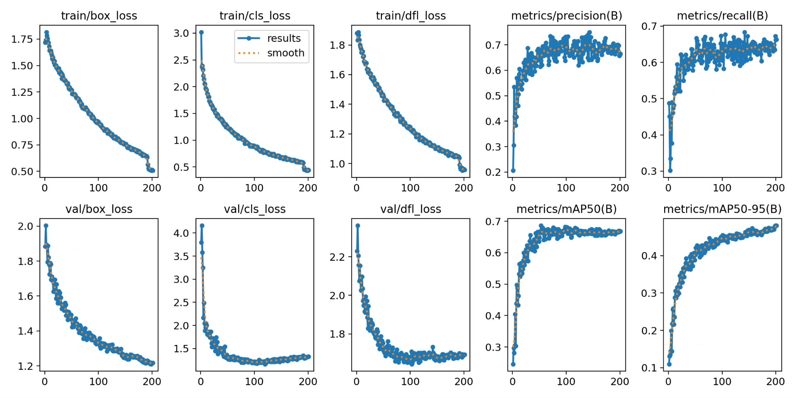
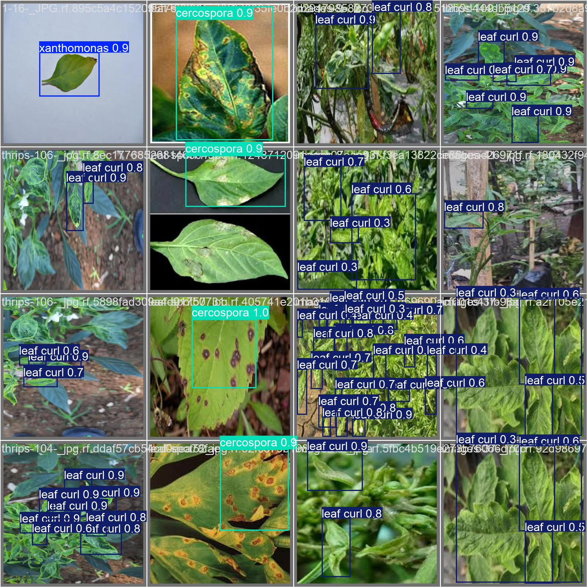
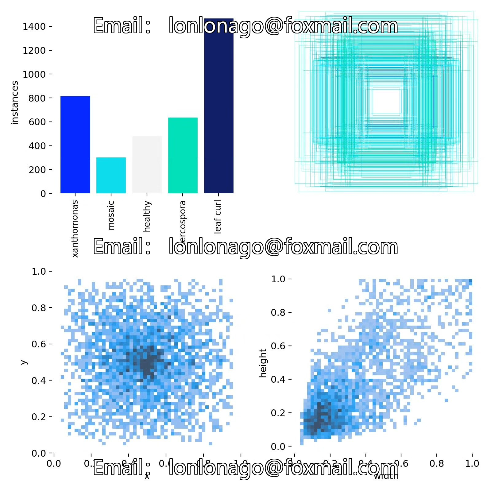
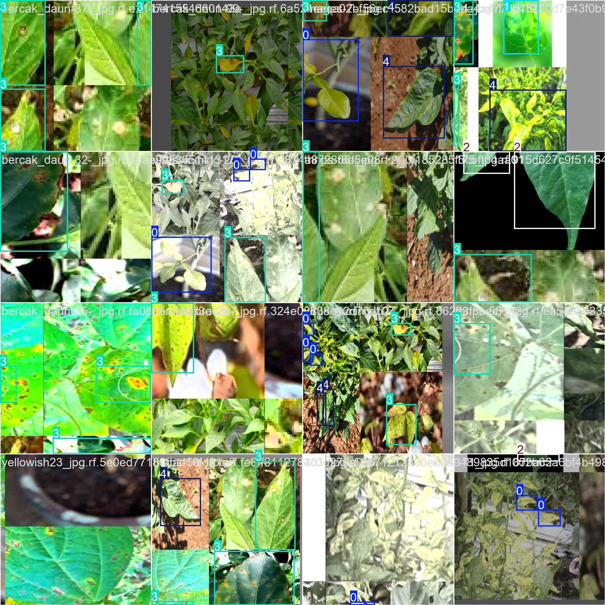

# Based on YOLOv8 deep learning for the detection of pepper leaf diseases

## Body

Based on the YOLOv8 deep learning algorithm, a high-efficiency and accurate intelligent detection system for pepper leaf diseases has been developed. The system can automatically identify and classify five types of pepper leaf states, including Xanthomonas, mosaic, healthy, cercospora, and leaf curl. The dataset includes 1796 training images and 462 validation images. Through data augmentation, model optimization, and transfer learning techniques, high-precision disease detection is achieved. This system can be deployed on mobile devices or embedded devices, providing farmers with real-time and convenient disease diagnosis tools to support the development of smart agriculture.

The company's products have obtained YOLO official commercial license certification.

We provide after-sales service.

After payment, we will provide WeChat IDs for instant questions.

Environmental configuration: We will provide an environmental configuration tutorial, and WeChat will provide answers.

Remote installation services: If you need remote configuration, an additional fee of 69 is required,

Configuration failure will result in all fees being refunded (specially for old computers only refund installation fees).

Retraining dataset: After setting up the environment, you can train on your own computer.
If you need us to retrain, just pay 69 + computing power fees (2.5 yuan/hour)

## Images

## Payment

Here is a pay link on Stripe ( https://buy.stripe.com/3cs8yP7sY87d0vu9AB ). Please contact me lonlonago@foxmail.com after funding $89, and I will send you a complete data files , thank you!

